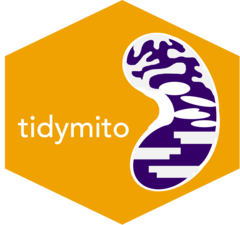

<!-- README.md is generated from README.Rmd. Please edit that file -->

```{r, include = FALSE}
knitr::opts_chunk$set(
  collapse = TRUE,
  comment = "#>",
  fig.path = "man/figures/README-",
  out.width = "100%"
)
```

# tidymito  </a>
**Convenient Analysis Of Mitochondrial Measurements & Data**

<!-- badges: start -->
<!-- badges: end -->

## Overview

tidymito aims to streamline (mitochondrial) biology research by automating common and repetitive data processing and analysis steps. Initial developments will be focused on reading and formatting measures of mitochondrial physiology from the **Oroboros O2K High Resolution Respirometer**, as well as more general measures of individual organism fitness (coming soon). 

> Note: This package is early in development and is being maintained by academics, not software developers! Please bear with us as we figure things, and check that outputs are reasonable.  Let us know if you would like to contribute, all are welcome! 

## Installation

You can install the development version of tidymito from [GitHub](https://github.com/) with:

```{r install, echo = TRUE}
# using pak: 
# if (!require(pak)) install.packages("pak") 

# install from GitHub repository:
 pak::pak("FiG-T/tidymito")

# OR 

# using devtools: 
# if (!require(devtools)) install.packages("devtools") 
# 
# devtools::install_github("FiG-T/tidymito")
```

## Examples

### Oroboros Data Import

Going from Oroboros measurements to neat data can bit a bit of a challenge (and often requires a lot of manual selections and copy-pasting).  The `read_o2k_oxy_csv()` function allows a user to go straight from the .csv file exported from the Oroboros Instrument to a tibble with the readings per state. 

This is a basic example which shows you how to solve a common problem:

```{r example}
library(tidymito)

testdata <- read_o2k_oxy_csv(
  file_id = "2025-03-03.*.csv", # a patten to match your exported file (or files)
  directory_path = "path/to/data/",
  exclude_events = c("11As"),  # as this is added at the same time as 11Tm, remove 11As
  treat_opening = "after",  # if a chamber is opened during a state, place the window after then chamber has re-oxygenated and closed.
  window_sizes = 15,  # if a measurement is taken every 2 seconds, the signal must be stable for 30 (2x15) seconds to pass the cutoff.
  change_thresholds = 1,
  format_output = TRUE, # select that you want the output tibble to be formatted
  sample_identifiers = c("NDi1-OE x gal4", "NDi1-OE ctrl"), # specify your unique sample identifiers
  wide_output = FALSE # specify that you want the data to be returned in a 'wide' format.
  )

```

## Issues and Help

If you encounter a clear bug, please file an issue with a minimal reproducible example on [GitHub](https://github.com/fig-t/tidymito/issues). 
